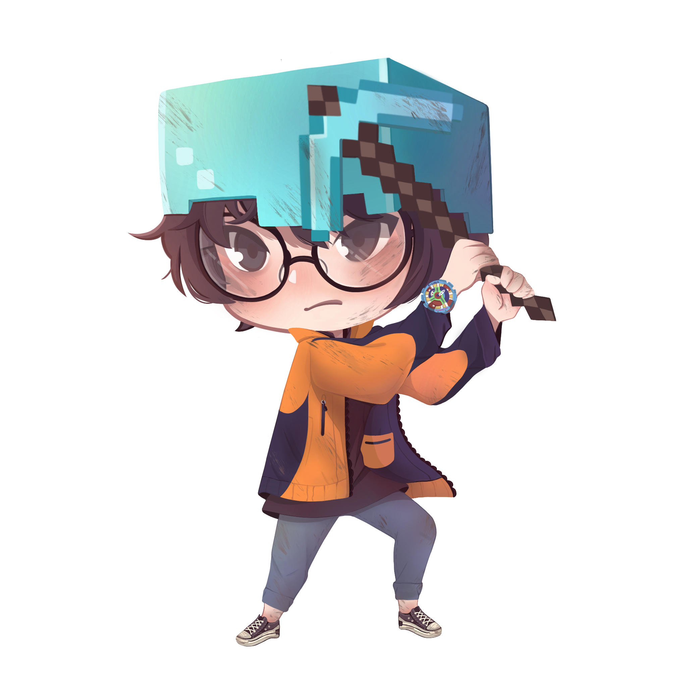

<h1>⚡️ <i>Hi, I'm Rayato159</i></h1>

<h2>🎲 <i>My Badges</i></h2>

  My real name is <strong><i>Ruangyot</i></strong> from Thailand. I've' got a full-time job as <strong><i>backend developer</i></strong>. 
  I have studied <strong><i>Aeronautical Engineering</i></strong>, But all I want to be is a software engineer. I had promised myself to never stop learning. <strong><i>That is the way I have decided</i></strong>.

<h2>📑 <i>Familiar with</i></h2>
<ul>
  <li><strong><i>Golang</i></strong></li>
  <ul>
    <li>⚡Go Fiber</li>
  </ul>
  

  <li><strong><i>Javascript/Node.js</i></strong></li>
  <ul>
    <li>⚛️ReactJs</li>
  </ul>
  

  <li><strong><i>Typescript</i></strong></li>
  <ul>
    <li>😼NestJS</li>
  </ul>
  

  <li><strong><i>Database</i></strong></li>
  <ul>
    <li>🐬MySQL</li>
    <li>🐘PostgreSQL</li>
    <li>🍃MongoDb</li>
  </ul>
</ul>

<h2>🎉 Events</h2>
<ul>
  <li><strong><i>⛳ Code Golf Party #1 - Bangkok, Thailand - 2022</i></strong></li>
  <ul>
    <li>
It is a recreational activity for programmers. It is an activity that provides programming problems to solve, and participants are challenged to find the shortest source code solution.</li>
  </ul>
</ul>
